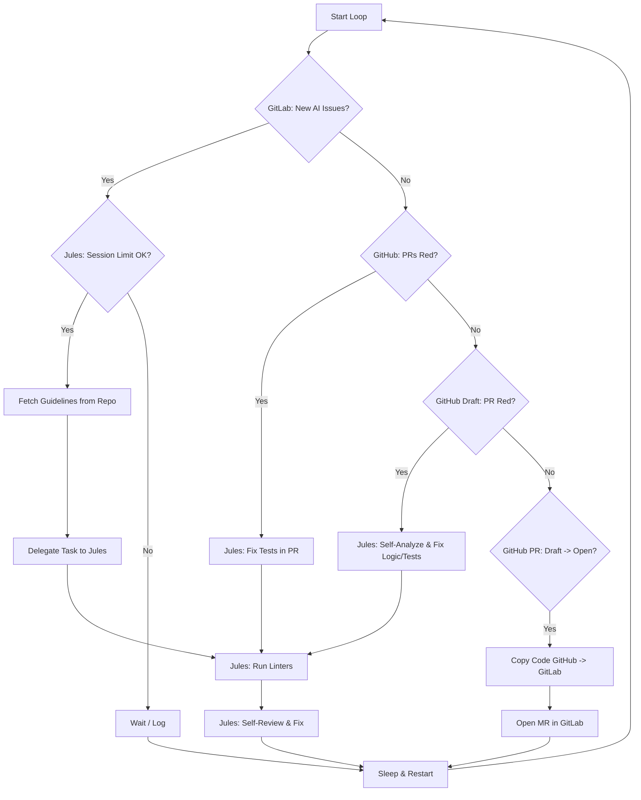

# AI Task Orchestrator (ATO)

ATO is a background worker that integrates GitLab, GitHub, and the Jules AI agent to automate task delegation, maintenance, and synchronization.

## Features
- **Module A: Monitoring & Delegation**: Polls GitLab for issues with the `AI` label and delegates them to Jules.
- **Module B: Maintenance**: Monitors GitHub Pull Requests for CI/CD failures (RED status) and tasks Jules with fixing them.
- **Module C: Synchronization**: Synchronizes open GitHub Pull Requests to GitLab Merge Requests.
- **Module D: Draft Maintenance**: Monitors Draft GitHub Pull Requests with failing pipelines for self-analysis and fixes.

## Architecture



## Configuration
The application is configured via environment variables (or a `.env` file). See `.env.example` for available options.

## Deployment
Run using Docker Compose:
```bash
docker-compose up -d
```

## Development
Install dependencies using `uv`:
```bash
uv sync
```

Run tests with coverage:
```bash
uv run pytest --cov=src --cov-report=term-missing --cov-fail-under=100
```
